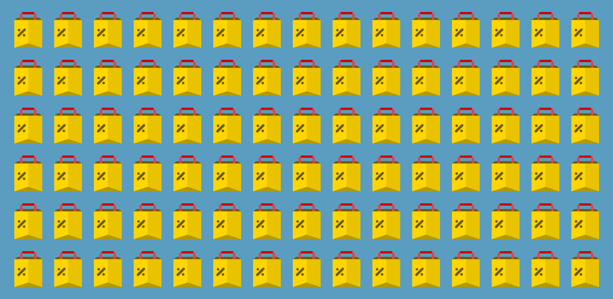
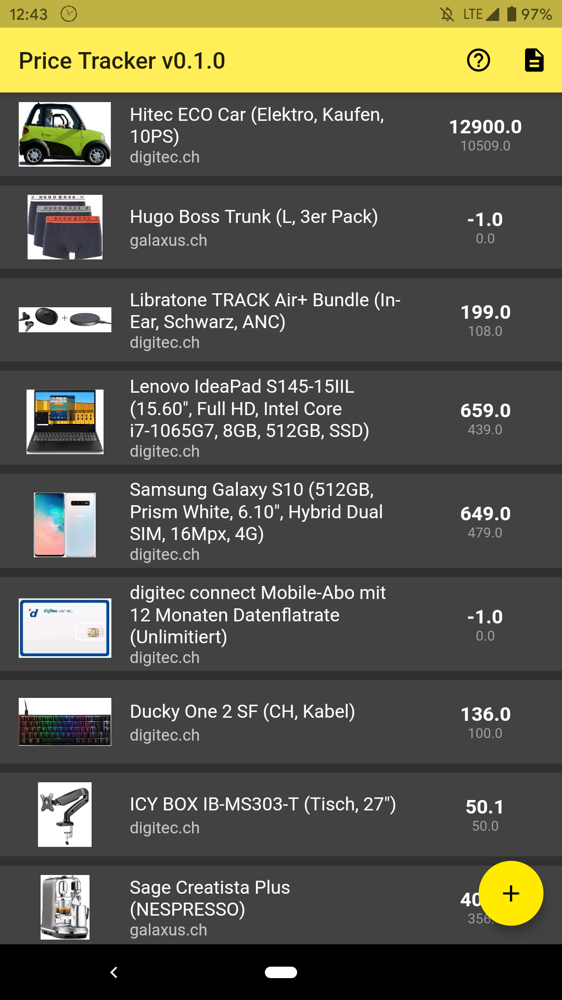
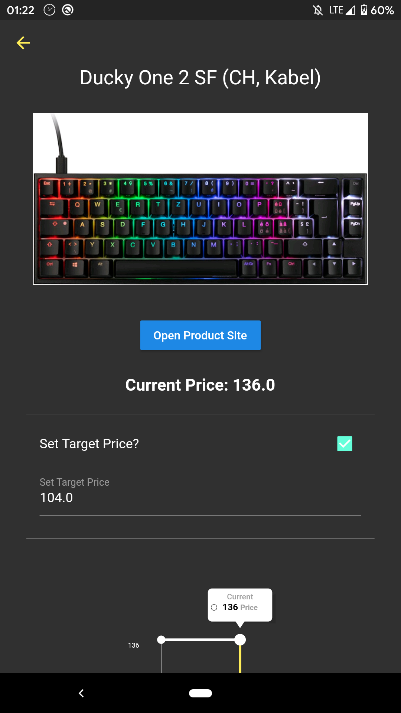
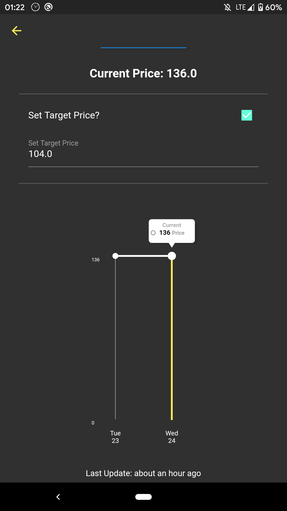

# Price Tracker
Price Tracker App built with Flutter.

With this application one can track the prices of several stores including digitec.ch and galaxus.ch.
The app runs a background service and updates prices once per day. Users will then be notified if prices dropped.

## Beta Store Listing
**_Coming_**

## Beta Screenshots
     

## ToDo's
- [ ] Styling
- [ ] Icon Optimisations for both Platforms
- [ ] Availability Detection + Notification

