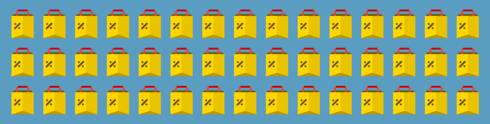
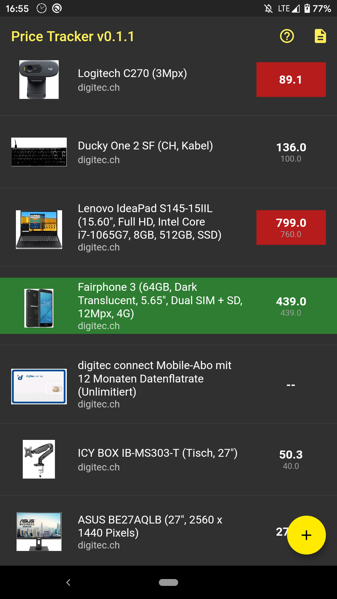
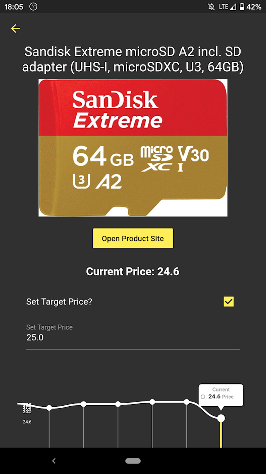
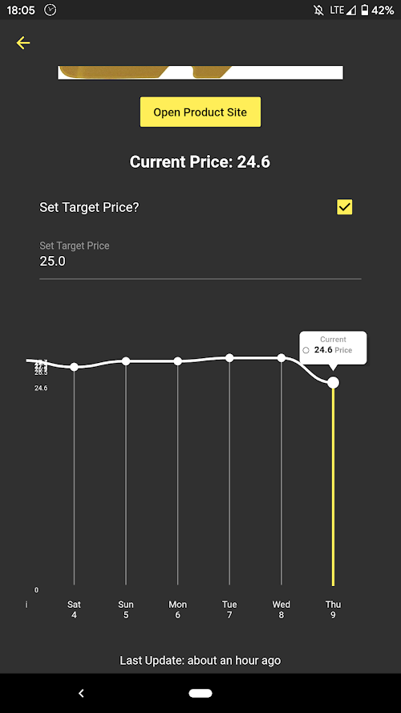

  

  

  

# Price Tracker
Price Tracker App built with Flutter.

**This is a Work in Progress**

With this application one can track the prices of many online stores including digitec.ch and galaxus.ch.  
The app runs a background service and updates prices once per day. Users will then be notified if prices dropped.

## Beta Store Listing

## Beta Screenshots
     

## Known Supported Online Stores
- digitec.ch, galaxus.ch
- brack.ch
- exlibris.ch
- melectronics.ch
- ikea.com
- distrelec.ch (and derivatives)
- apple.com
- play-zone.ch
- officeworld.ch
- amazon.com, amazon.de

